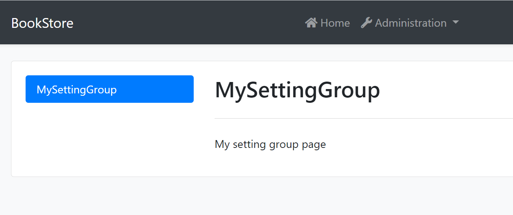

# Custom Setting Page

There are several settings tabs from different modules. You can add a custom setting page to your project.

### Create a setting View Component

Create `MySettingGroup` folder under the `Components` folder. Add a new view component. Name it as `MySettingGroupViewComponent`:


Open the `MySettingGroupViewComponent.cs` and change the whole content as shown below:

```csharp
public class MySettingGroupViewComponent : AbpViewComponent
{
    public virtual IViewComponentResult Invoke()
    {
        return View("~/Components/MySettingGroup/Default.cshtml");
    }
}
```

> You can also use the `InvokeAsync` method, In this example, we use the `Invoke` method.

### Default.cshtml

Create a `Default.cshtml` file under the `MySettingGroup` folder.

Open the `Default.cshtml` and change the whole content as shown below:

```html
<div>
  <p>My setting group page</p>
</div>
```

### BookStoreSettingPageContributor

Create a `BookStoreSettingPageContributor.cs` file under the `Settings` folder:


The content of the file is shown below:

```csharp
public class BookStoreSettingPageContributor : ISettingPageContributor
{
    public Task ConfigureAsync(SettingPageCreationContext context)
    {
        context.Groups.Add(
            new SettingPageGroup(
                "Volo.Abp.MySettingGroup",
                "MySettingGroup",
                typeof(MySettingGroupViewComponent)
            )
        );

        return Task.CompletedTask;
    }

    public Task<bool> CheckPermissionsAsync(SettingPageCreationContext context)
    {
        // You can check the permissions here
        return Task.FromResult(true);
    }
}
```

Open the `BookStoreWebModule.cs` file and add the following code:

```csharp
Configure<SettingManagementPageOptions>(options =>
{
    options.Contributors.Add(new BookStoreSettingPageContributor());
});
```

### Run the Application

Navigate to `/SettingManagement` route to see the changes:

