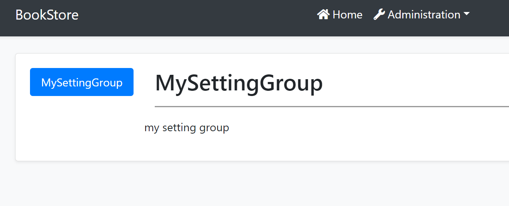

# 自定义设置页面

一些模块内置了设置页面,你也可以在项目中添加自己的设置页面.

### 创建 Razor 组件

在 `Pages` 目录下创建 `MySettingGroup` 文件夹, 添加一个名为 `MySettingGroupComponent` 的Razor组件:


打开 `MySettingGroupComponent.razor` 替换为以下内容:

```csharp
<Row>
    <p>my setting group</p>
</Row>
```

### BookStoreSettingComponentContributor

在 `Settings` 目录下创建 `BookStoreSettingComponentContributor.cs` 文件.


文件内容如下:

```csharp
public class BookStoreSettingComponentContributor : ISettingComponentContributor
{
    public Task ConfigureAsync(SettingComponentCreationContext context)
    {
        context.Groups.Add(
            new SettingComponentGroup(
                "Volo.Abp.MySettingGroup",
                "MySettingGroup",
                typeof(MySettingGroupComponent)
            )
        );

        return Task.CompletedTask;
    }

    public Task<bool> CheckPermissionsAsync(SettingComponentCreationContext context)
    {
        // You can check the permissions here
        return Task.FromResult(true);
    }
}
```

打开 `BookStoreBlazorModule.cs` 文件添加以下代码:

```csharp
Configure<SettingManagementComponentOptions>(options =>
{
    options.Contributors.Add(new BookStoreSettingComponentContributor());
});
```

### 运行应用程序

导航到 `/setting-management` 路由查看更改:

